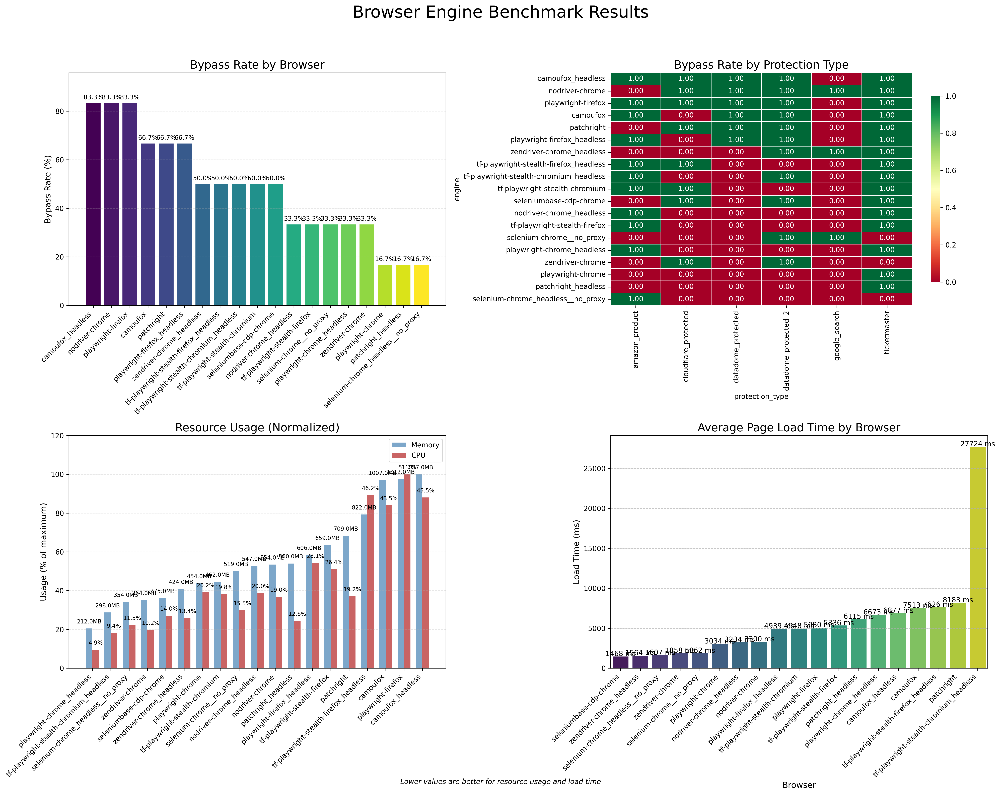
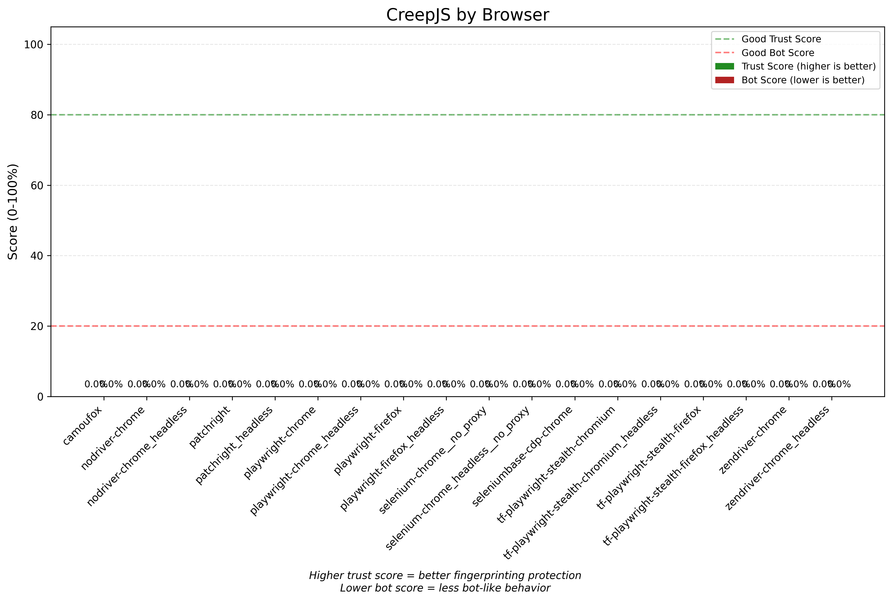

# Browser Engine Benchmark

[](https://www.python.org/downloads/)
[](LICENSE)

A toolkit for testing browser automation engines against modern web protection systems. It checks how well each engine can bypass bot detection and measures their speed, resource usage, and resistance to fingerprinting.

## 🎯 Overview
Modern web applications use advanced bot detection like Cloudflare, DataDome, and Imperva to block automated access. This benchmark suite shows how different browser automation engines handle these defenses:
- **Bypass Success Rate**: Effectiveness against major protection systems
- **Performance Metrics**: Memory usage, CPU consumption, and page load times
- **Fingerprinting Resistance**: reCAPTCHA scores and CreepJS trust ratings
- **Network Analysis**: IP detection (proxy validation) and WebRTC leak testing

## 🚀 Key Features
### Protection System Testing
- **Cloudflare** 
- **DataDome**   
- **Amazon** 
- **Google Search** 
- **Ticketmaster (Imperva)**
- <i>More systems coming soon</i>

### Browser Engine Support
- <a href="https://playwright.dev">**Playwright**</a> - Microsoft's automation framework (Chrome, Firefox, Safari)
- <a href="https://camoufox.com">**Camoufox**</a> - Playwright-based
- <a href="https://github.com/Kaliiiiiiiiii-Vinyzu/patchright-python">**Patchright**</a> - Playwright-based
- <a href="https://github.com/tinyfish-io/tf-playwright-stealth">**Playwright Stealth**</a> - Playwright-based
- <i>More engines coming soon</i>

### Analytics
- Automated report generation with visualizations
- Performance profiling and resource usage tracking
- Exportable results in JSON and Markdown formats

## 🔒 **Important: Proxy Requirements**
**Using a clean proxy is essential for accurate benchmark results.**
<details>
<summary>Why Proxies Are Required</summary>

- **IP Reputation**: Your home/datacenter IP may already be flagged by protection systems from previous automation attempts, browser extensions, or security software
- **Clean Testing Environment**: A fresh proxy IP ensures you're testing the browser engine's capabilities, not your IP's reputation
- **Rate Limiting**: Repeated tests from the same IP can trigger rate limiting, affecting bypass success rates
</details>

## 📊 Sample Results
This benchmark provides detailed comparative analysis. Here's an excerpt from a recent test run (more in <a href="results/example">results/example</a>):  
<i>Real IP in this example - 169.150.201.11</i>  
<i>Proxy IP in this example - 200.71.127.84</i>

### Overall Bypass Rate
| Engine | Bypass Rate (%) |
|-----------------|----------------:|
| camoufox_headless | 66.7 |
| tf-playwright-stealth-firefox_headless | 66.7 |
| patchright | 50.0 |
| camoufox | 50.0 |
| tf-playwright-stealth-chromium_headless | 50.0 |
| playwright-firefox_headless | 50.0 |
| tf-playwright-stealth-chromium | 50.0 |
| playwright-firefox | 50.0 |
| tf-playwright-stealth-firefox | 50.0 |
| patchright_headless | 33.3 |
| playwright-chrome | 33.3 |
| playwright-chrome_headless | 33.3 |


### Resource Usage Comparison
| Engine | Memory Usage (MB) | CPU Usage (%) |
|-----------------|------------------:|--------------:|
| playwright-chrome_headless | 210.0 | 10.3 |
| patchright_headless | 212.0 | 0.0 |
| tf-playwright-stealth-chromium_headless | 216.0 | 0.0 |
| tf-playwright-stealth-chromium | 409.0 | 15.5 |
| playwright-chrome | 421.0 | 15.5 |
| patchright | 530.0 | 5.2 |
| playwright-firefox_headless | 800.0 | 15.5 |
| tf-playwright-stealth-firefox_headless | 802.0 | 15.5 |
| tf-playwright-stealth-firefox | 830.0 | 0.0 |
| playwright-firefox | 865.0 | 0.0 |
| camoufox_headless | 944.0 | 5.2 |
| camoufox | 1073.0 | 46.4 |

If the CPU usage is 0 - failed to measure or it really is 0 for CDP sessions. The problem is known and will be fixed.

### Recaptcha Scores - https://antcpt.com/score_detector
| Engine | Recaptcha Score (0-1) |
|-----------------|--------------------:|
| camoufox | 0.30 |
| tf-playwright-stealth-chromium | 0.30 |
| tf-playwright-stealth-firefox | 0.30 |
| tf-playwright-stealth-chromium_headless | 0.30 |
| patchright_headless | 0.10 |
| patchright | 0.10 |
| camoufox_headless | 0.10 |
| playwright-chrome | 0.10 |
| playwright-firefox_headless | 0.10 |
| playwright-firefox | 0.10 |
| playwright-chrome_headless | 0.10 |
| tf-playwright-stealth-firefox_headless | 0.10 |

`
This Score is taken by solving the reCAPTCHA v3 on your browser.
The Score shows if Google considers you as HUMAN or BOT.
1.0 is very likely a good interaction, 0.0 is very likely a bot
With low score values (< 0.3) you'll get a slow reCAPTCHA 2, it would be hard to solve it.
And vise versa, with score >= 0.7 it will be much easier. 
`


## CreepJS Scores - https://abrahamjuliot.github.io/creepjs
| Engine | Trust Score (%) | Bot Score (%) | WebRTC IP |
|-----------------|----------------:|--------------:|----------:|
| patchright_headless | 69.00 | 13.00 | 169.150.201.11 |
| playwright-firefox_headless | 69.00 | 13.00 | 169.150.201.11 |
| playwright-firefox | 62.50 | 13.00 | 169.150.201.11 |
| patchright | 61.50 | 13.00 | 169.150.201.11 |
| playwright-chrome_headless | 61.50 | 13.00 | 169.150.201.11 |
| camoufox_headless | 59.50 | 13.00 | 200.71.127.84 |
| camoufox | 59.50 | 13.00 | 200.71.127.84 |
| playwright-chrome | 47.50 | 13.00 | 169.150.201.11 |
| tf-playwright-stealth-chromium | 0.00 | 25.00 | 169.150.201.11 |
| tf-playwright-stealth-chromium_headless | 0.00 | 25.00 | 169.150.201.11 |
| tf-playwright-stealth-firefox | 0.00 | 25.00 | 169.150.201.11 |
| tf-playwright-stealth-firefox_headless | 0.00 | 25.00 | 169.150.201.11 |

Applicapable only with proxy.
If the WebRTC IP is different from your real IP - no leakage


## IP (2ip) 
| Engine | IP |
|-----------------|----------:|
| camoufox | 200.71.127.84 |
| camoufox_headless | 200.71.127.84 |
| patchright | 200.71.127.84 |
| patchright_headless | 200.71.127.84 |
| playwright-chrome | 200.71.127.84 |
| playwright-chrome_headless | 200.71.127.84 |
| playwright-firefox | 200.71.127.84 |
| playwright-firefox_headless | 200.71.127.84 |
| tf-playwright-stealth-chromium | 200.71.127.84 |
| tf-playwright-stealth-chromium_headless | 200.71.127.84 |
| tf-playwright-stealth-firefox | 200.71.127.84 |
| tf-playwright-stealth-firefox_headless | 200.71.127.84 |

Applicapable only with proxy.
If the IP is your proxy's IP - good, your real IP - bad.

### Visual Dashboard


### Recaptcha Score Visualization


### CreepJS Visualization


## 🛠️ Installation

### Quick Start
1. **Clone the repository**
   ```bash
   git clone https://github.com/techinz/browsers-benchmark.git
   cd browsers-benchmark
   ```

2. **Set up Python environment**
   ```bash
   python -m venv venv
   source venv/bin/activate  # On Windows: venv\Scripts\activate
   pip install -r requirements.txt
   ```

3. **Install browser engines**

   **Playwright**
   ```bash
   playwright install
   # On Linux also run:
   playwright install-deps
   ```

   **Camoufox**
   ```bash
   # Windows
   camoufox fetch
   
   # Linux  
   python -m camoufox fetch
   sudo apt install -y libgtk-3-0 libx11-xcb1 libasound2
   ```

   **Patchright**
   ```bash
   patchright install chromium
   ```

   **BotBrowser** (Optional)
   - Download from [BotBrowser Releases](https://github.com/MiddleSchoolStudent/BotBrowser/releases)
   - Extract to `documents/binaries/botbrowser/`
   - Change `PathSettings.botbrowser_executable_path` in `config/settings.py` (follow instructions in BotBrowser's repo)

4. **Configure settings**
   ```bash
   cp .env.example .env
   # Edit .env with your proxy settings if needed
   ```

5. **Run benchmark**
   ```bash
   python main.py
   ```

## ⚙️ Configuration

### Environment Variables (.env)
```bash
# Proxy Configuration (Optional, but highly recommended)
PROXY_ENABLED=true
PROXY_PROTOCOL=http
PROXY_HOST=your.proxy.host
PROXY_PORT=8080
PROXY_USERNAME=username
PROXY_PASSWORD=password

# Performance Settings
PAGE_LOAD_TIMEOUT_MS=90000
PAGE_STABILIZATION_DELAY_S=5
MAX_RETRIES=3
```

### Custom Target Configuration
1. Modify `config/benchmark_targets.py` to add custom test targets:

    ```python
    Target(
        name="custom_site",
        url="https://example.com",
        check_function="check_custom_bypass",
        description="Custom site protection test"
    )
    ```
2. Create a check function for the target in `utils/targets/check_bypass`, for example in a file named `custom_bypass.py`:
    ```python
    from engines.base import BrowserEngine

    async def check_custom_bypass(engine: BrowserEngine) -> bool:
        element_found, element_html = await engine.query_selector('//div[@class="captcha"]')

        return not element_found # no captcha found - success!
    ```
3. Add it to the checkers mapping in `config/benchmark_targets.py`'s `BypassTargetsSettings`:
    ```python
    checkers: Dict[str, Callable] = Field(
        default_factory=lambda: {
            "check_cloudflare_bypass": check_cloudflare_bypass,
            "check_datadome_bypass": check_datadome_bypass,
            ...
            "check_custom_bypass": check_custom_bypass,
        }
    )
    ```

## 📈 Output & Reports

The benchmark generates reports in the `results/` directory:

- **`summary.md`** - Human-readable markdown report
- **`benchmark_results_*.json`** - Raw data for further analysis  
- **`media/`** - Generated visualizations and screenshots
  - `bypass_dashboard.png` - Multi-metric dashboard
  - `recaptcha_scores.png` - reCAPTCHA performance chart
  - `creepjs_scores.png` - Fingerprinting resistance analysis
  - `screenshots` - Screenshots of all tested targets

## 🏗️ Architecture

The codebase follows a modular architecture for extensibility:

```
├── config/           # Configuration management
├── engines/          # Browser engine implementations  
├── utils/
│   ├── targets/      # Test target definitions
│   ├── report/       # Report generation system
│   ├── logging/      # Structured logging
│   └── ...
└── results/          # Output directory
```

### Adding New Engines
Extend the `BrowserEngine` base class:

```python  
class CustomEngine(BrowserEngine):
    async def start(self) -> None:
        # Initialize browser
        
    async def navigate(self, url: str) -> Dict[str, Any]:
        # Navigation logic
```

Or, if Playwright-based, extend `PlaywrightBase` base class:
```python  
class CustomPlaywrightBasedEngine(PlaywrightBase):
    ...
```

## 🔧 Platform-Specific Notes

### BotBrowser Installation

**Windows:**
1. Download the .7z archive from releases
2. Extract and run `chrome.exe`
3. If encountering STATUS_ACCESS_VIOLATION, use `--no-sandbox` flag

**Linux:**
1. Rename downloaded .deb to .zip
2. Extract and locate `data.tar.xz`
3. Copy `data/opt/chromium.org/chromium` to `documents/binaries/botbrowser/`

### Troubleshooting

**Common Issues:**
- **Detection failures**: Verify proxy configuration and target accessibility

## 🤝 Contributing

Contributions are welcome! Areas where help is needed:
- **New Protection Systems**: Add support for additional bot detection services
- **Browser Engines**: Implement support for new automation frameworks (e.g. Selenium-based)
- **Analysis Tools**: Enhance reporting and visualization

## 📝 License
This project is licensed under the MIT License - see the [LICENSE](LICENSE) file for details.

## ⚠️ Disclaimer
This tool is designed for educational and research purposes. Users are responsible for ensuring compliance with website terms of service and applicable laws. The authors and contributors do not encourage or endorse any malicious use of this software.